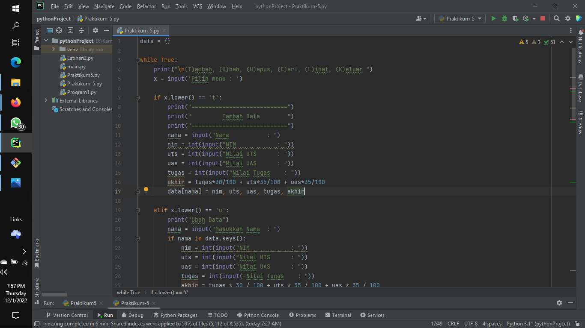
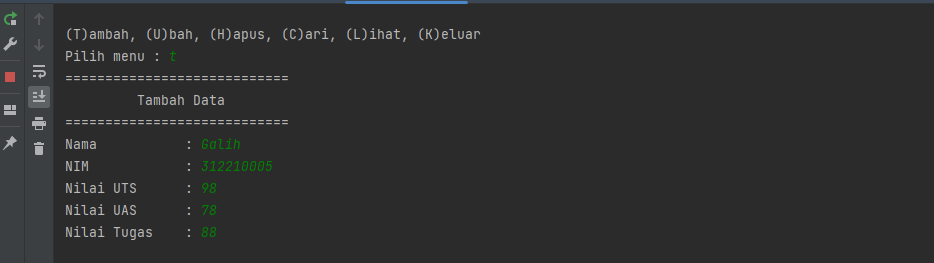
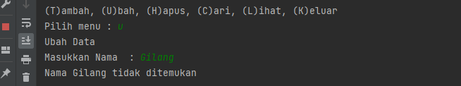
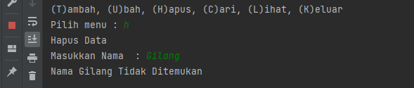
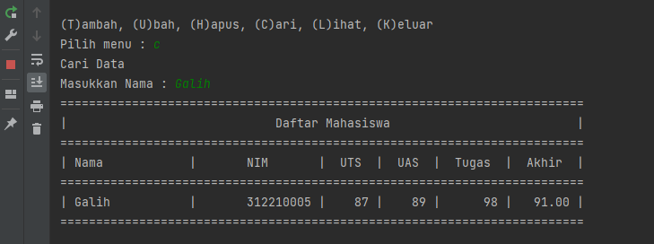
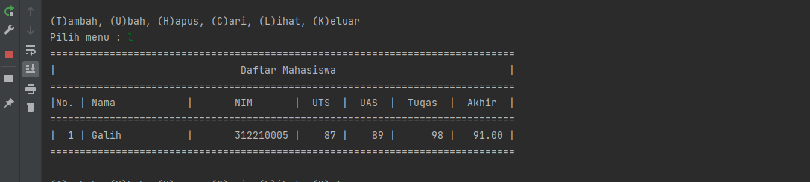
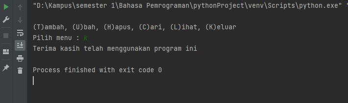

## Praktikum 6

# PENJELASAN PERULANGAN WHILE PADA PYTHON
*Dictionary Python berbeda dengan List ataupun Tuple. Karena setiap urutanya berisi key dan value. Setiap key dipisahkan dari value-nya oleh titik dua (:), item dipisahkan oleh koma, dan semuanya tertutup dalam kurung kurawal. Dictionary kosong tanpa barang ditulis hanya dengan dua kurung kurawal, seperti ini: {}.*

# PROGRAM MEBUAT DATA MAHASISWA DENGAN RINCIAN BERIKUT :
- Memasukan menu `Cari`, `Tambah`, `Lihat`, `Ubah`, `Hapus`, `Keluar`

# Alur dan Penjelasan program tersebut
 1. Pastikan kita mempunya software pycharm atau vscode, jika belum anda bisa download [Pycharm](https://www.jetbrains.com/pycharm/download/#section=windows) atau [VSCode](https://code.visualstudio.com/download)
 2. Instalasi salah satu software tersebut hingga selesai, lalu buka 
 3. Jika sudah semua masukan kodingan seperti dibawah ini
 ```bash
 data = {}

while True:
    print("\n(T)ambah, (U)bah, (H)apus, (C)ari, (L)ihat, (K)eluar ")
    x = input('Pilih menu : ')

    if x.lower() == 't':
        print("============================")
        print("         Tambah Data        ")
        print("============================")
        nama = input("Nama           : ")
        nim = int(input("NIM            : "))
        uts = int(input("Nilai UTS      : "))
        uas = int(input("Nilai UAS      : "))
        tugas = int(input("Nilai Tugas    : "))
        akhir = tugas*30/100 + uts*35/100 + uas*35/100
        data[nama] = nim, uts, uas, tugas, akhir

    elif x.lower() == 'u':
        print("Ubah Data")
        nama = input("Masukkan Nama  : ")
        if nama in data.keys():
            nim = int(input("NIM            : "))
            uts = int(input("Nilai UTS      : "))
            uas = int(input("Nilai UAS      : "))
            tugas = int(input("Nilai Tugas    : "))
            akhir = tugas * 30 / 100 + uts * 35 / 100 + uas * 35 / 100
            data[nama] = nim, uts, uas, tugas, akhir
        else:
            print("Nama {0} tidak ditemukan".format(nama))

    elif x.lower() == 'h':
        print("Hapus Data")
        nama = input("Masukkan Nama  : ")
        if nama in data.keys():
            del data[nama]
        else:
            print("Nama {0} Tidak Ditemukan".format(nama))

    elif x.lower() == 'c':
        print("Cari Data")
        nama = input("Masukkan Nama : ")
        if nama in data.keys():
            print("="*73)
            print("|                             Daftar Mahasiswa                          |")
            print("="*73)
            print("| Nama            |       NIM       |  UTS  |  UAS  |  Tugas  |  Akhir  |")
            print("="*73)
            print("| {0:15s} | {1:15d} | {2:5d} | {3:5d} | {4:7d} | {5:7.2f} |"
                  .format(nama, nim, uts, uas, tugas, akhir))
            print("="*73)
        else:
            print("Nama {0} Tidak Ditemukan".format(nama))

    elif x.lower() == 'l':
        if data.items():
            print("="*78)
            print("|                               Daftar Mahasiswa                             |")
            print("="*78)
            print("|No. | Nama            |       NIM       |  UTS  |  UAS  |  Tugas  |  Akhir  |")
            print("="*78)
            i = 0
            for z in data.items():
                i += 1
                print("| {no:2d} | {0:15s} | {1:15d} | {2:5d} | {3:5d} | {4:7d} | {5:7.2f} |"
                      .format(z[0][:13], z[1][0], z[1][1], z[1][2], z[1][3], z[1][4], no=i))
            print("=" * 78)
        else:
            print("="*78)
            print("|                               Daftar Mahasiswa                             |")
            print("="*78)
            print("|No. | Nama            |       NIM       |  UTS  |  UAS  |  Tugas  |  Akhir  |")
            print("="*78)
            print("|                                TIDAK ADA DATA                              |")
            print("="*78)

    elif x.lower() == 'k':
        print("Terima kasih telah menggunakan program ini")
        break

    else:
        print("Pilih menu yang tersedia")
```

 4. Save dan Run Program tersebut

# PENJELASAN
 1. Pada baris pertama kita buat dictionary kosong, fungsinya untuk menginput data-data dalam program tersebut dan memudahkan kita untuk memanggil data itu lagi.
 data{}
 2. Selanjutnya kita membuat kondisi perulngan menggunakan perulangan While True. Yang artinya ketika kita menginputkan yang berdasarkan pada syntax maka jawabannya benar, tetapi jika tidak maka akan break
 3. Syntax Menambah Data
 ```bash
     if x.lower() == 't':
        print("============================")
        print("         Tambah Data        ")
        print("============================")
        nama = input("Nama           : ")
        nim = int(input("NIM            : "))
        uts = int(input("Nilai UTS      : "))
        uas = int(input("Nilai UAS      : "))
        tugas = int(input("Nilai Tugas    : "))
        akhir = tugas*30/100 + uts*35/100 + uas*35/100
        data[nama] = nim, uts, uas, tugas, akhir
```
 Disini apabila kita menginputkan 't' maka kita akan diminta untuk menginputkan beberapa data. Data yang kita inputkan akan masuk ke dictionary 'data' yang telah dibuat tadi dengan data 'nama' sebagai keys dan sisanya sebagai valuesnya.
 Hasil dari syntax tambah data.
 
 4. Syntax Mengubah Data
 ```bash
     elif x.lower() == 'u':
        print("Ubah Data")
        nama = input("Masukkan Nama  : ")
        if nama in data.keys():
            nim = int(input("NIM            : "))
            uts = int(input("Nilai UTS      : "))
            uas = int(input("Nilai UAS      : "))
            tugas = int(input("Nilai Tugas    : "))
            akhir = tugas * 30 / 100 + uts * 35 / 100 + uas * 35 / 100
            data[nama] = nim, uts, uas, tugas, akhir
        else:
            print("Nama {0} tidak ditemukan".format(nama))
 ```
 Apabila kita menginput 'u' maka akan ada keterangan untuk mengubah data dan kita akan diminta untuk menginputkan nama yang mau diubah datanya, apabila nama tidak ada maka outputnya "Nama {} tidak ditemukan". Dimana {} adalah nama/data yang mau kita ubah.
 
 5. Syntax Menghapus Data
 ```bash
     elif x.lower() == 'h':
        print("Hapus Data")
        nama = input("Masukkan Nama  : ")
        if nama in data.keys():
            del data[nama]
        else:
            print("Nama {0} Tidak Ditemukan".format(nama))
 ```
 Apabila kita menginput 'h' maka kita akan diminta menginput nama yang akan dihapus. Jika nama ada di dalam dictionary, maka system akan menghapus keys/nama tersebut beserta valuesnya pada statement del data[ nama ].
 
 6. Syntax Mencari Data
 ```bash
     elif x.lower() == 'c':
        print("Cari Data")
        nama = input("Masukkan Nama : ")
        if nama in data.keys():
            print("="*73)
            print("|                             Daftar Mahasiswa                          |")
            print("="*73)
            print("| Nama            |       NIM       |  UTS  |  UAS  |  Tugas  |  Akhir  |")
            print("="*73)
            print("| {0:15s} | {1:15d} | {2:5d} | {3:5d} | {4:7d} | {5:7.2f} |"
                  .format(nama, nim, uts, uas, tugas, akhir))
            print("="*73)
        else:
            print("Nama {0} Tidak Ditemukan".format(nama))
 ```
 Apabila kita menginputkan 'c' maka kita akan diminta untuk memasukkan nama yang akan dicari. Apabila nama yang dicari ada di dalam dictionary maka outputnya akan menampilkan data dari nama tersebut.
 
 7. Syntax Melihat Data
 ```bash
     elif x.lower() == 'l':
        if data.items():
            print("="*78)
            print("|                               Daftar Mahasiswa                             |")
            print("="*78)
            print("|No. | Nama            |       NIM       |  UTS  |  UAS  |  Tugas  |  Akhir  |")
            print("="*78)
            i = 0
            for z in data.items():
                i += 1
                print("| {no:2d} | {0:15s} | {1:15d} | {2:5d} | {3:5d} | {4:7d} | {5:7.2f} |"
                      .format(z[0][:13], z[1][0], z[1][1], z[1][2], z[1][3], z[1][4], no=i))
            print("=" * 78)
        else:
            print("="*78)
            print("|                               Daftar Mahasiswa                             |")
            print("="*78)
            print("|No. | Nama            |       NIM       |  UTS  |  UAS  |  Tugas  |  Akhir  |")
            print("="*78)
            print("|                                TIDAK ADA DATA                              |")
            print("="*78)
 ```
 Apabila kita menginput 'l' maka sistem akan menampilkan data - data yang sudah kita masukkan. Jika kita belum memasukkan data maka outputnya menjadi "TIDAK ADA DATA".
 
 8. Syntax untuk menghentikan perulangan/keluar dari program
 ```bash
     elif x.lower() == 'k':
        print("Terima kasih telah menggunakan program ini")
        break
 ```
 Apabila kita menginput 'k' maka semua perulangan akan berhenti/keluar dari program
 

Demikian Praktikum 6 telah dilaksanakan, untuk materi bisa kalian akses [disini](https://drive.google.com/file/d/11V7DtnlbJbefuKGfdlm80KuBPTo3L4f-/view)